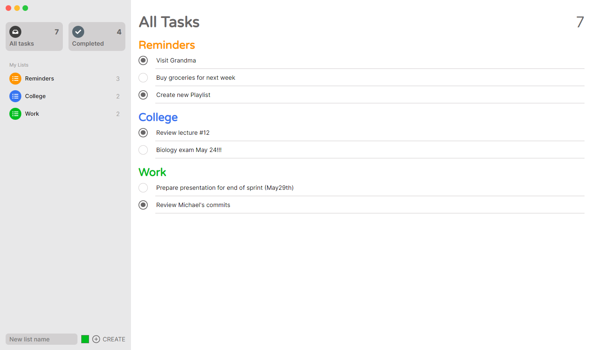

# **Mac Reminders App Clone**

  

 

<h4 align="center" style="font-weight: 500">
Developed with
</h4>

  
  
  

  <a href="#key-features">Key Features</a> •
   <a href="#how-to-use">How To Use</a> •
  <a href="#installation">Installation</a> •
  <a href="#stuff-i-learned">Stuff I learned</a> 

This project is a clone of the Mac Reminders app, developed solely for practice purposes. It faithfully replicates the functionality and user interface of the original app but does not store any tasks or generate any form of monetary benefits. Please note that this clone is intended for educational and personal use only and is not affiliated with or endorsed by Apple Inc. You can try the web app [here](https://gabrielcornejob.github.io/mac-reminders-clone/).

## **Key Features**

- Create TaskLists
  - With customizable name and color
- Create, Read, Update & Delete Tasks
  - Every task is an input and gets saved onBlur
- Mark Tasks as completed
- View All Tasks
- View All Completed Tasks

## **How to use**

You'll land on the "All Tasks" page, there, you'll see that there's an already created Reminders list, on the sidebar, you can either click on an existing list or at the bottom of the sidebar create a new one.

- **Create Task:** Click on a created list and on the top right corner there's a + sign. It will create a new empty task.
- **Update Task:** Click on a task, and just write in it, after your mouse leaves the input, it will save.
- **Delete Task:** Click on a task and then press the DELETE key.
- **Mark as completed:** Just click the circle on the left of a task.

> The creation of a Task must be done inside a List View, but you can delete, update and mark as complete in any of the other Views of the application.

## **Installation**

If you want to use the app locally, type the following commands using your command line:

    # Clone this repository
    $ git clone https://github.com/GabrielCornejoB/mac-reminders-clone

    # Navigate to directory
    $ cd mac-reminders.clone

    # Install required dependencies
    $ npm install

    # Run the app
    $ npm run dev

## **Stuff I learned**

- More usage of the useRef hook, with useState it may have been easier, but it would re-render way more the application.
- At the beginning, I tried using my state like a noSQL model, and it was waaaaaay overcomplicating a lot of stuff, so I changed to a more relational SQL approach for managing my state.
- Absolute imports are wonderfull, and I have to use them way more.
- I can't spend that much time in small projects like this, I am very perfectionist and I want every detail to be perfect. But after some days, I remembered that the purpose of this was to practice, and learn. So from now on, I'll set a limit of time for each of this small projects, so in the future I won't get stuck over little details, and progress more with other stuff.
- I think I am using Scss the wrong way, I'm overcomplicating a lot of things that I have to change for my next Scss project.
- Man I love React + TS.
